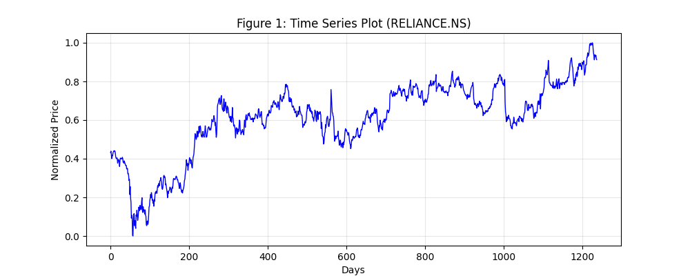
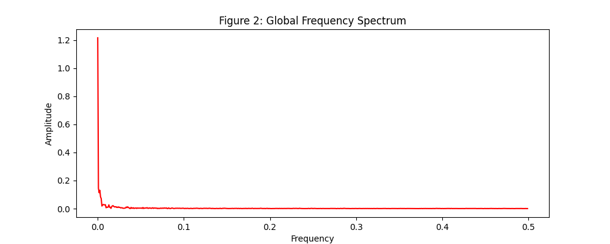
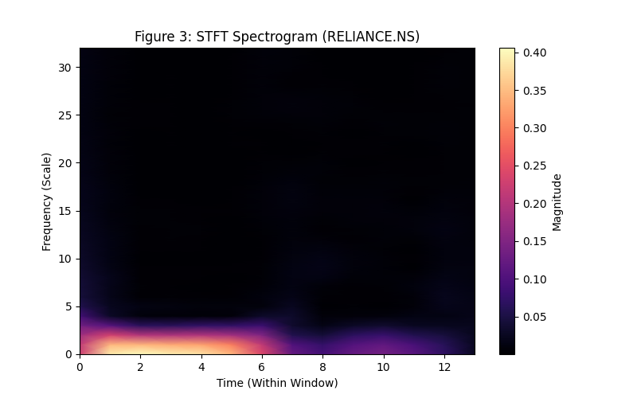
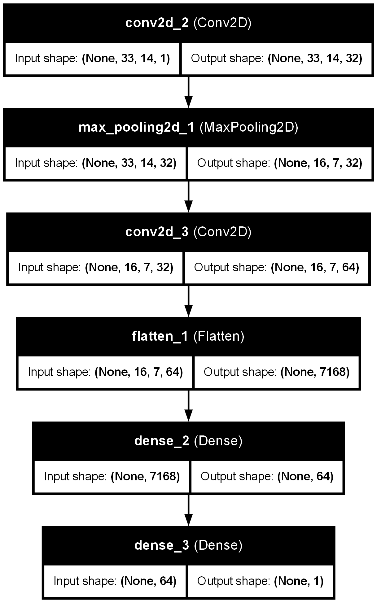
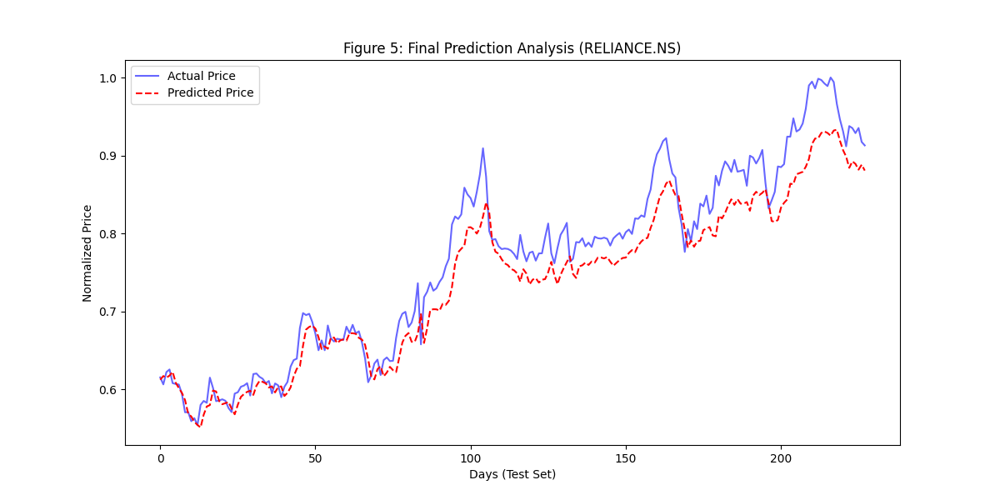

 📊 Pattern Recognition for Financial Time Series Forecasting

Student Name : Aneena S S
University Register Number : TCR24CS012

 🔷 Project Objective
The objective of this project is to combine **Time–Frequency Signal Processing** (STFT) and **Deep Learning** (CNN) to predict future stock prices. Financial time series data is non-stationary, meaning its statistical properties change over time. This project uses spectrograms to capture hidden time-varying patterns for improved prediction.
 
 🔷 Problem Description
We analyze multivariate financial data including:
* Stock prices (RELIANCE.NS, TCS.NS, HDFCBANK.NS)
* Market trends over time
These variables are treated as a signal:
X(t) = [p(t), r(t), g(t), s(t), d(t)]
The goal is to transform this signal into a **time–frequency representation** and use a CNN model to predict future stock prices.

 🔷 Methodology
 1. Data Acquisition
* Data fetched using `yfinance`
* Companies used:
  * RELIANCE.NS
  * TCS.NS
  * HDFCBANK.NS

 2. Data Preprocessing
* Handling missing values
* Normalization using MinMaxScaler

 3. Time–Frequency Transformation
* Applied **Short-Time Fourier Transform (STFT)**
* Sliding window approach used to analyze segments of data
* Generated **spectrograms** representing energy distribution

 4. STFT Explanation
The Short-Time Fourier Transform (STFT) analyzes signals in both time and frequency domains using a sliding window. It helps capture time-varying frequency patterns in non-stationary financial data.

 5. CNN Model
A Convolutional Neural Network (CNN) is used for regression.

 Architecture:
* Conv2D (32 filters) + ReLU
* MaxPooling
* Conv2D (64 filters) + ReLU
* MaxPooling
* Flatten
* Dense (128 neurons)
* Output Layer (1 neuron for price prediction)

 🔷 System Pipeline
Time Series Data → STFT → Spectrogram → CNN Model → Price Prediction

 🔷 Evaluation Metric
Mean Squared Error (MSE) is used:
MSE = (1/n) Σ (y_true - y_pred)²

 🔷 Visual Results
 📈 Figure 1: Time Series Data

 📊 Figure 2: Frequency Spectrum (FFT)

 🔥 Figure 3: STFT Spectrogram

🧠 Figure 4: CNN Architecture

 📉 Figure 5: Prediction vs Actual

 🔷 Result
* Model achieved **Mean Squared Error (MSE ≈ 0.0006)**
* Spectrograms successfully captured hidden patterns
* CNN effectively learned time-frequency features

 🔷 Technologies Used
* Python
* NumPy
* Pandas
* Matplotlib
* SciPy (STFT)
* Scikit-learn
* TensorFlow / Keras
* yfinance

🔷 Project Structure
* data/ → Dataset files
* src/ → Source code
* results/ → Output graphs and images
* README.md → Documentation

 🔷 Conclusion
The project demonstrates that financial time series can be effectively analyzed as signals. By transforming data into spectrograms, hidden time-frequency patterns can be captured. The CNN model successfully leverages these patterns to predict stock prices with good accuracy.

## 🔷 References

1. Stock Market Prediction Using Deep Learning (IEEE Access)
2. Deep Learning for Financial Time Series Forecasting
3. Hochreiter & Schmidhuber – LSTM (1997)
4. Conditional Time Series Forecasting with CNNs

---
